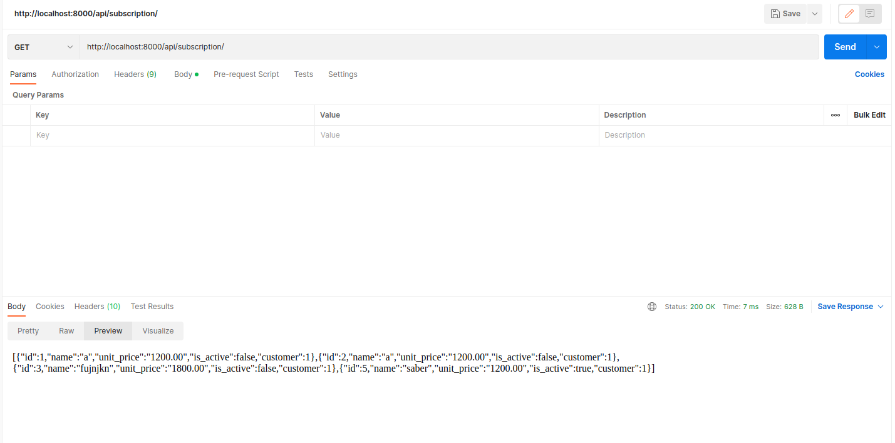

# Cloud-Finantial-Structure


A template for README files that can be used for your future projects. A small description about the project, shields as well as the link to your repo.

Open and view the Project using the `.zip` file provided or at my [GitHub Repository]

The project is also hosted on [GitHub Pages]

## Table of Contents
- [Getting Started](#getting-started)
	- [Tools Required](#tools-required)
	- [Installation](#installation)
- [Development](#development)
    - [Part 1: Heading](#part-1-heading)
	  - [Step 1: Subheading](#step-1-subheading)
	  - [Step 2: Subheading](#step-2-subheading)
	- [Part 2: Heading](#part-2-heading)
- [Running the App](#running-the-app)
- [Deployment](#deployment)
- [Contributing](#contributing)
- [Versioning](#versioning)
- [Authors](#authors)
- [License](#license)
- [Acknowledgments](#acknowledgments)

## Getting Started

### Tools Required

* Python 3.9
* Django 4.2
* djangorestframework 3.14
* celery 5.2
* django-celery-beat 2.5
* redis 4.5

### Installation

All installation steps go here.

After you cloned the repository, you want to create a virtual environment, so you have a clean python installation. You can do this by running the command:
```
python -m venv env
```

After this, it is necessary to activate the virtual environment, you can get more information about this [here](https://docs.python.org/3/tutorial/venv.html)

You can install all the required dependencies by running
```
pip install -r requirements.txt
```

## Structure
In a RESTful API, endpoints (URLs) define the structure of the API and how end users access data from our application using the HTTP methods - GET, POST, PUT, DELETE.

Endpoint |HTTP Method | CRUD Method | Result
-- | -- |-- |--
`subscription` | GET | READ | Get all subscriptions of the customer
`invoice` | GET | READ | Get all invoices of the customer
`subscription`| POST | CREATE | Create a new subscriptions for the customer
`invoicehistory` | GET | READ | Get number of all the customer invoices and the customer cost
`activate/:id` | PUT | UPDATE | Activate a subscription
`deactivate/:id` | PUT | UPDATE | Deactivate a subscription

## Use

In first terminal, we have to start up Django's development server:
```bash
python manage.py runserver
```
In second terminal, we run the broker server:
```bash
redis-server
```
In Third terminal, we run the scheduler:
```bash
celery -A celeryapp beat -l info
```
In Fourth terminal, we run the Celery worker:
```bash
celery -A celeryapp worker -l info
```

Now we should open [admin](http://127.0.0.1:8000/admin/) interface of our project in the browser and create a customer.Then we can create a token for required authorization.
We can test the API using [Postman](https://www.postman.com/), first we should set Authorization Key to toke for each api test as below:


Now we test apis:

1.POST method of subscription api:


1.GET method of subscription api:



1.GET method of invoice api:


1.GET method of invoicehistory api:


1.PUT method of activate api:


1.PUT method of deactivate api:


[//]: # (HyperLinks)

[GitHub Repository]: https://github.com/madhur-taneja/README-Template
[GitHub Pages]: https://madhur-taneja.github.io/README-Template
[CONTRIBUTING.md]: https://github.com/madhur-taneja/README-template/blob/master/CONTRIBUTING.md
[tags]: https://github.com/madhur-taneja/README-template/tags

[GitHub]: https://github.com/mohsenkk
[LinkedIn]: https://www.linkedin.com/in/madhur-taneja/

[contributors]: https://github.com/madhur-taneja/README-template/contributors
[license]: https://github.com/madhur-taneja/README-template/blob/master/LICENSE.md
